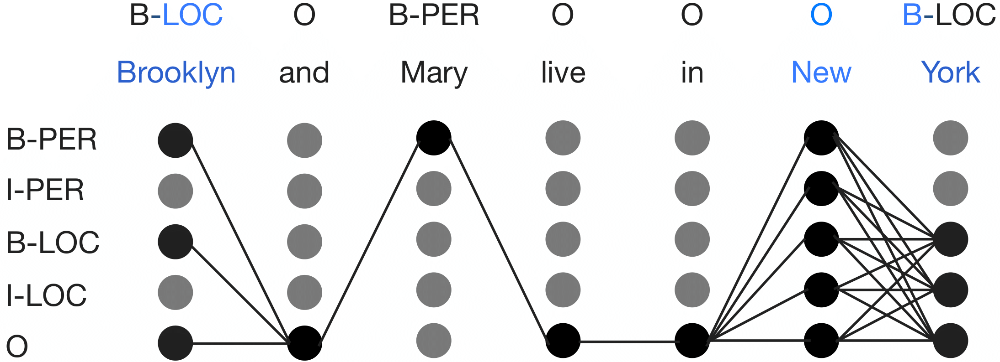

Kun Liu*, Yao Fu*, Chuanqi Tan, Mosha Chen, Ningyu Zhang, Songfang Huang, Sheng Gao. Noisy-Labeled NER with Confidence Estimation. NAACL 2021. [[arxiv](https://arxiv.org/abs/2104.04318)]

## Requirements
```bash
pip install -r requirements.txt

```
## Data
The format of datasets includes three columns, the first column is word, the second column is noisy labels and the third column is gold labels. For datasets without golden labels, you could set the third column the same as the second column. We provide the CoNLL 2003 English with recall 0.5 and precision 0.9 in './data/eng_r0.5p0.9'

## Confidence Estimation Strategies
### Local Strategy
```bash
python confidence_estimation_local.py --dataset eng_r0.5p0.9 --embedding_file ${PATH_TO_EMBEDDING} --embedding_dim ${DIM_OF_EMBEDDING} --neg_noise_rate ${NOISE_RATE_OF_NEGATIVES} --pos_noise_rate ${NOISE_RATE_OF_POSITIVES}

```
For '--neg_noise_rate' and '--pos_noise_rate', you can set them as -1.0 to use golden noise rate (experiment 12 in Table 1 For En), or you can set them as other values (i.e., --neg_noise_rate 0.09 --pos_noise_rate 0.14 for experiment 10, En)

### Global Strategy
```bash
python confidence_estimation_global.py --dataset eng_r0.5p0.9 --embedding_file ${PATH_TO_EMBEDDING} --embedding_dim ${DIM_OF_EMBEDDING} --neg_noise_rate ${NOISE_RATE_OF_NEGATIVES} --pos_noise_rate ${NOISE_RATE_OF_POSITIVES}
```
For 'neg_noise_rate' and 'pos_noise_rate', you can set them as -1.0 to use golden noise rate (experiment 13 in Table 1 for En), or you can set them as other values (i.e., --neg_noise_rate 0.1 --pos_noise_rate 0.13 for experiment 11, En)

### Key Implementation
equation (3) is implemented in ./model/linear_partial_crf_inferencer.py, line 79-85.

equation (4) is implemented in ./model/neuralcrf_small_loss_constrain_local.py, line 139.

equation (5) is implemented in ./confidence_estimation_local.py, line 74-87 or ./confidence_estimation_global.py, line 75-85.

equation (6) and (7) are implemented in ./model/neuralcrf_small_loss_constrain_global.py, line 188-194 or ./model/neuralcrf_small_loss_constrain_local.py, line 188-197.

For global strategy, equation (8) is implemented in ./model/neuralcrf_small_loss_constrain_global.py, line 195-214 and ./model/linear_partial_crf_inferencer.py, line 36-48. For local strategy, equation (8) is implemented in ./model/neuralcrf_small_loss_constrain_local.py, line 198-215 and ./model/linear_crf_inferencer.py, line 36-48.
